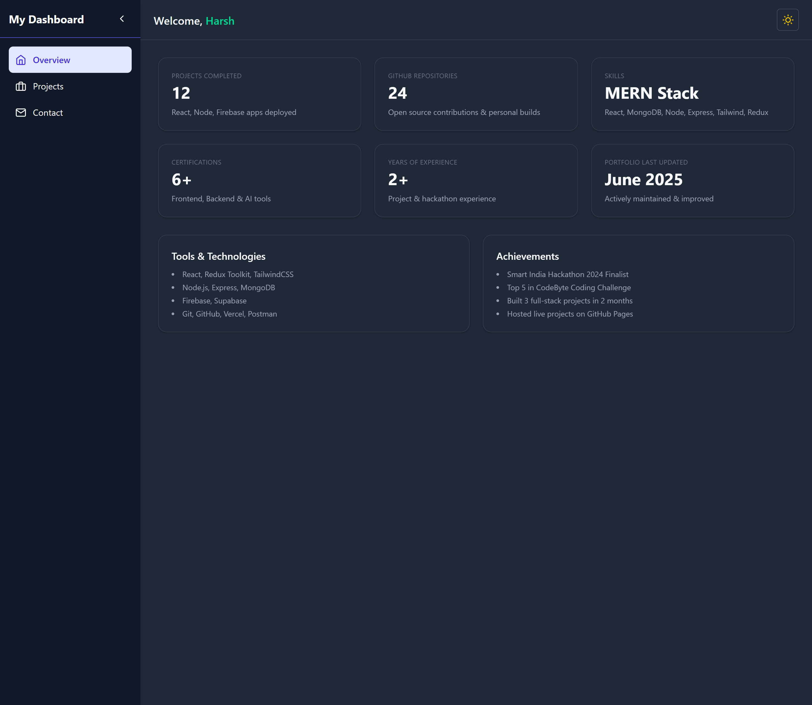
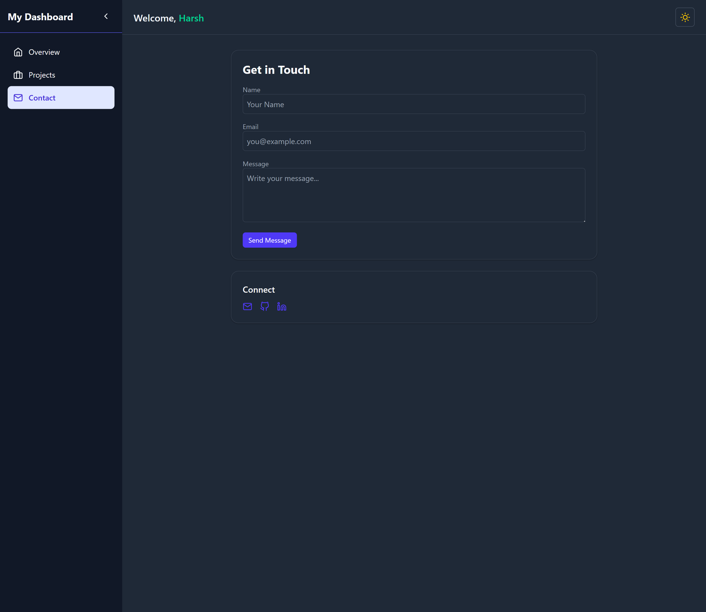

# Portfolio Dashboard

A responsive portfolio dashboard built with **React.js**, **Redux Toolkit**, and **Tailwind CSS**. This project features a collapsible sidebar, a top navbar, dark/light theme toggling, and mock sections like Overview, Projects, and Contact.

---

## Features

- Collapsible Sidebar (Redux managed)  
- Light/Dark Mode Toggle  
- Fully Responsive Layout  
- Reusable Components (Card, Button, etc.)  
- Mock Content Pages (Overview, Projects, Contact)  
- State Management with Redux Toolkit  
- Animations using Framer Motion  

---

## Folder Structure

Portfolio-Dashboard/  
├── public/  
├── screenshots/  
├── src/  
│ ├── components/  
│ ├── features/ # Redux slices  
│ ├── pages/  
│ ├── redux/ # Redux store config  
│ ├── App.jsx  
│ └── main.jsx  
└── tailwind.config.js  

---

## Tech Stack

- React.js  
- Redux Toolkit  
- Tailwind CSS  
- Framer Motion  

---

## Installation & Setup

To run this project locally:

```bash
git clone https://github.com/Harsh14-prog/Portfolio-Dashboard.git
cd Portfolio-Dashboard
npm install
npm run dev


```

## Screenshots

### Projects


### Overview


###  Contact Section


###  Light Mode


---

## Contact

- LinkedIn: [Harshad Khambe](https://www.linkedin.com/in/harshad-khambe-33b06a255/)
- GitHub: [@Harsh14-prog](https://github.com/Harsh14-prog)
- Email: harshadkhambe14@gmail.com


